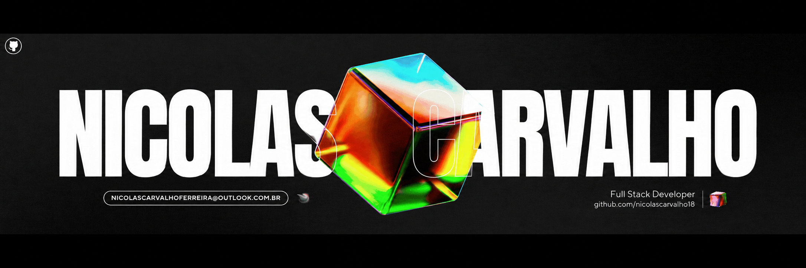

#

  

#

<h3 align="left">Sobre mim:</h3>

Meu nome é Nicolas Carvalho Ferreira e sou Desenvolvedor Full Stack, com experiência em desenvolvimento backend Java e criação de aplicações web. Trabalho com Java, Spring Boot, APIs REST, bancos de dados relacionais e tecnologias modernas de frontend.

Também estudo Engenharia de Software, Cibersegurança e Inteligência Artificial. Busco desenvolver soluções bem estruturadas, seguras e fáceis de manter, aplicando Clean Code, SOLID, testes automatizados, Git e integração contínua.

Tenho interesse em projetos Java, backend, APIs, aplicações Full Stack, cloud, DevOps e segurança da informação. Estou sempre aprimorando meus conhecimentos e criando projetos que resolvam problemas reais.

#

<h3 align="left">My Stack:</h3>

  
  
  
  
  
  
  
  
  
  
  
  
  
  
  
  
  
  
  
  
  
  
  
  
  

#

<h3 align="left">Contato:</h3>

  
  

<i>"Transformando ideias em código e soluções em resultados."</i>

